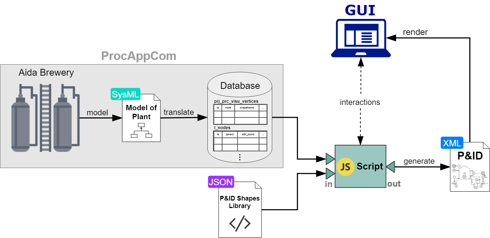
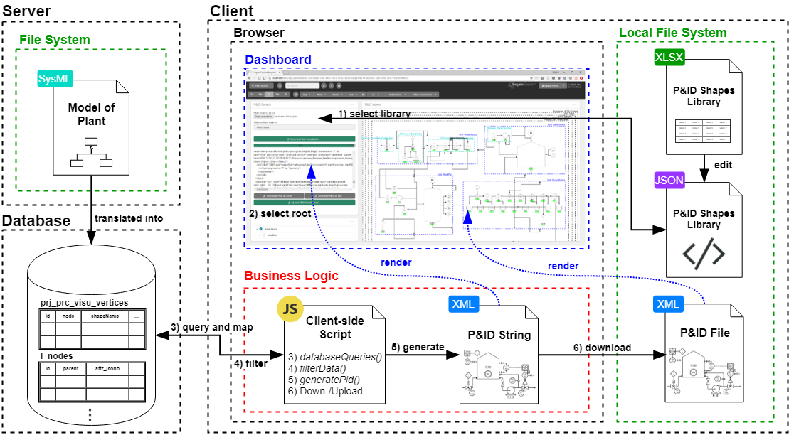
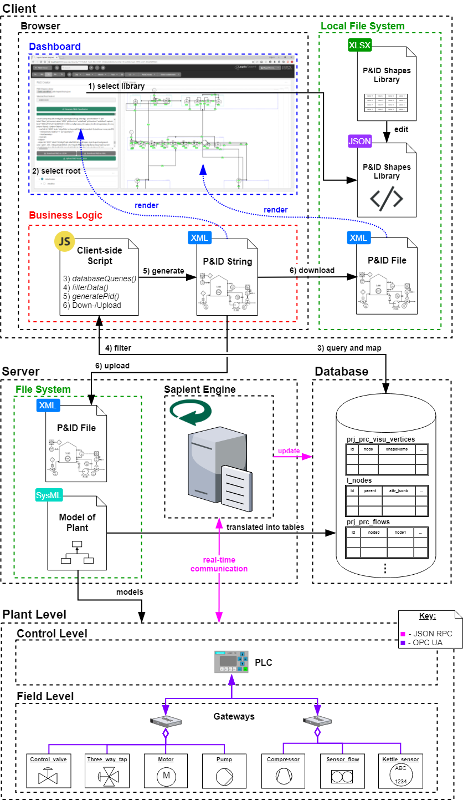
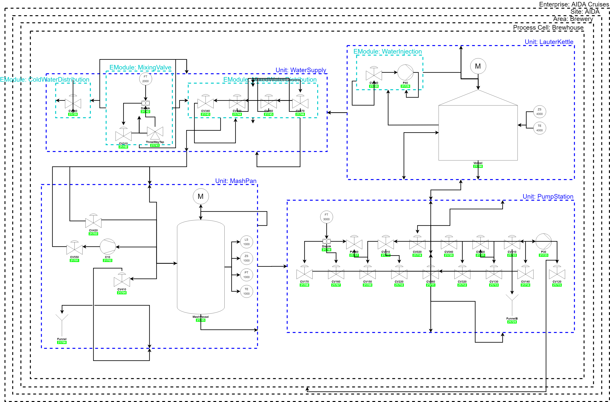

# tum-mw-bachelorarbeit
Dynamic Generation of Modular Industrial Plant Visualizations on a Manufacturing Execution System (MES) Interface

## Conceptual Overview

  

## System Architecture

#### Compact system architecture

  

#### Extended system architecture

  

## Evaluation Result

  

